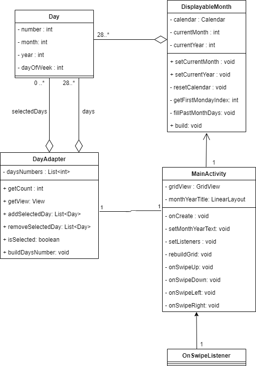

# Calendar
Test technique - Axel Houlès

## Vidéo de démonstation
Une vidéo de démonstration de l'application est disponible à l'adresse suivante : https://youtu.be/4SCkbQve4GQ

## Télécharger l'APK
Si vous souhaitez installer l'APK sur votre smartphone ou emulateur, vous pouvez la télécharger ici : https://github.com/Haarkan/Calendar/releases/tag/1.0

## Build le projet 
Cloner le repository directement dans android studio ou taper :
> git clone https://github.com/Haarkan/Calendar

## Diagramme de classes

## Doccumentation
Le projet contient deux activities : Splash, qui s'affiche au lancement de l'application puis disparait au bout de 1.5 secondes et Main, qui contient notre calendrier.

Le calendrier s'affiche dans une gridview, les items affichés dedans sont des "GridViewsItems" contenant le numéro du jour 

La classe DisplayableMonth gère la génération du mois à afficher dans le calendrier sous la forme d'une liste de Day. Cette liste peut ensuite être convertie en liste de int pour être affichée via un rafraîchissement du dayAdapter dans l'activity principale.

Les jours sélectionnés sont stockés dans l'activité principale et dans le dayAdapter sous la forme d'une liste de Day. L'activité principale transmet cette liste au dayAdapter lorsqu'il est rafraîchit. Cela permet de garder en mémoire tous jours séléctionnés (utile lors d'un changement de mois). Si l'on veut réaliser un traitement sur les jours sélectionés (ex : création d'évenements), il suffira d'utiliser la liste stockée dans MainActivity puisqu'elle contient tous les jours sélectionnés.
